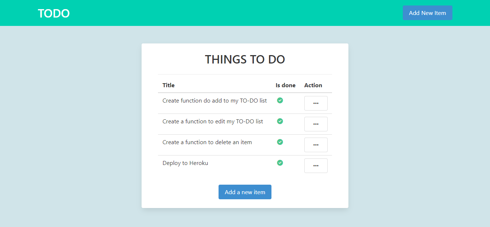
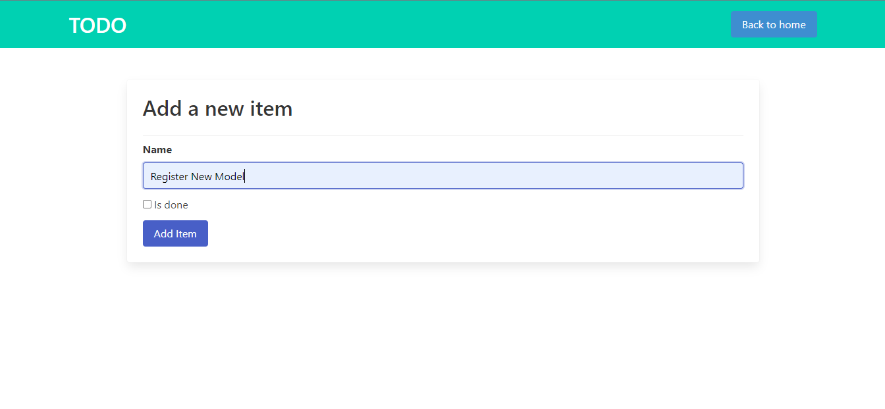
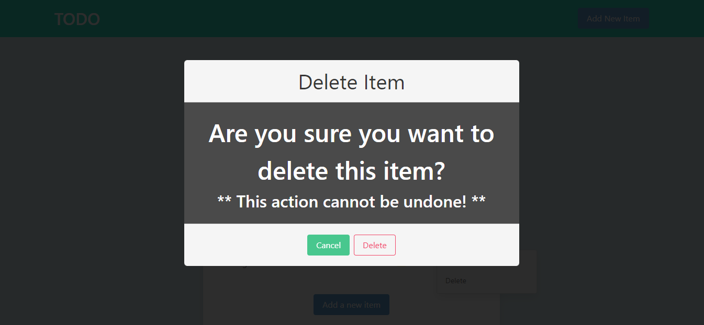

**# TO-DO webapp (Django + Postgresql)**

This application made with Django + Postgresql Database. In this app, the user is able to add a to do item, edit and delete. The application is deployed on Heroku.

